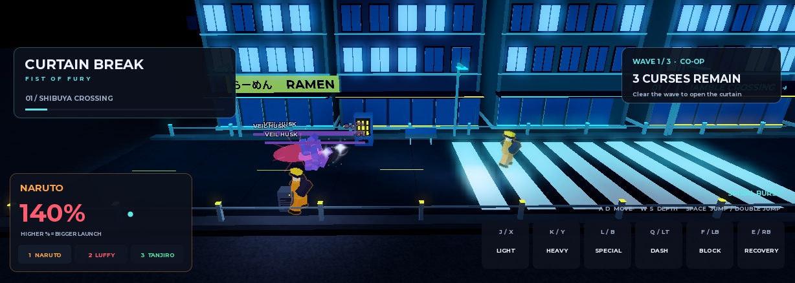

# Curtain Break — Fist of Fury

A Roblox anime co-op beat-em-up set along a controlled, Shibuya-inspired city route. The campaign follows Bare Knuckle / Streets of Rage stage pacing, with Smash-inspired rising damage, launch strength, recovery and three stocks.

**Status: playable development slice, not a finished Jujutsu Shenanigans-quality release.** See [validation](docs/VALIDATION.md) and the independent [quality review](docs/QUALITY_REVIEW.md) for measured results and remaining work.

## Play
Open [places/CurtainBreak.rbxl](places/CurtainBreak.rbxl) in Roblox Studio and press Play. The committed place includes the editable city. The Rojo source build creates it when simulation starts. `build/CurtainBreak-Editable.rbxl`, when saved from Studio, includes the city for edit-time inspection.

- A/D move, W/S lane depth, Space jump / double jump
- Mouse1 or J light combo, K heavy launcher, L special
- Q dash, F hold block, E recovery
- 1 Naruto, 2 Luffy, 3 Tanjiro; hero cards and touch buttons are clickable
- Clear each district's three waves, rally at its right gate, then advance together
- Party wipe offers retry at the current district; clearing the station boss completes the run

Gamepad equivalents are in [CONTROLS](docs/CONTROLS.md). Intended party size: 1–4.

## Build from source
Install [Rojo](https://rojo.space/docs/v7/getting-started/installation/) 7.7.0, then:
```sh
mkdir build
rojo build default.project.json -o build/CurtainBreak.rbxlx
rojo serve default.project.json
```
Connect the Studio Rojo plugin to the local server for editing. The project uses server-authoritative combat and no runtime HTTP dependencies. Source animations are serialized R6 keyframes; no private animation IDs are required.

## What is implemented
Three authored districts, enemy waves and boss, differentiated hero kits and silhouettes, server hit validation, percent knockback, stock respawns, party wipe/retry, bounded lane movement, follow camera, responsive HUD, touch/gamepad bindings, enemy warnings, distinct hero specials, 21 breakable street props with bounded debris and restoration, client impact effects, and actual reviewed Toolbox animation/VFX/hitbox ingredients.

## Project memory
- [Design brief and decisions](docs/DESIGN.md)
- [World bible](docs/WORLD_BIBLE.md)
- [Story and future beats](docs/STORY.md)
- [References](docs/REFERENCES.md)
- [Toolbox asset register](docs/ASSET_REGISTER.md)
- [Combat architecture](docs/COMBAT.md)
- [Quality review](docs/QUALITY_REVIEW.md)
- [Roadmap](docs/ROADMAP.md)

Anime names are prototype fan-theme references. Final published franchise likenesses, music, marketplace permissions and experience-owner animation publishing require a production asset pass. No anime footage or soundtrack is bundled.

## Studio co-op test

